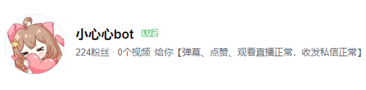

<a href="https://space.bilibili.com/1289725599">

<h3 align="center">小心心bot 3.0</h3>

[使用方法](https://www.bilibili.com/read/cv17703581)

# 简介

这是小心心bot的源码，部署成功后可以使某个账号具备小心心bot的功能

# 部署方式

- [Docker 部署](md/docker.md)
- [直接部署（ 需要.Net 8 SDK）](md/direct.md)

# 感谢

- [bilibili-pcheartbeat](https://github.com/lkeme/bilibili-pcheartbeat) 小心心bot的直播心跳包加密算法是从这个库借鉴的

# 注意

整个项目的实现是全异步的，当你要添加功能时，请一定记得使用异步，以免阻塞。

# License 许可证

[MIT](LICENSE)